# FireVision Pro: Technical Diagrams & Detailed Flowcharts
## Supplementary Technical Documentation

---

## 🔄 System Integration Flow

### Complete System Data Flow

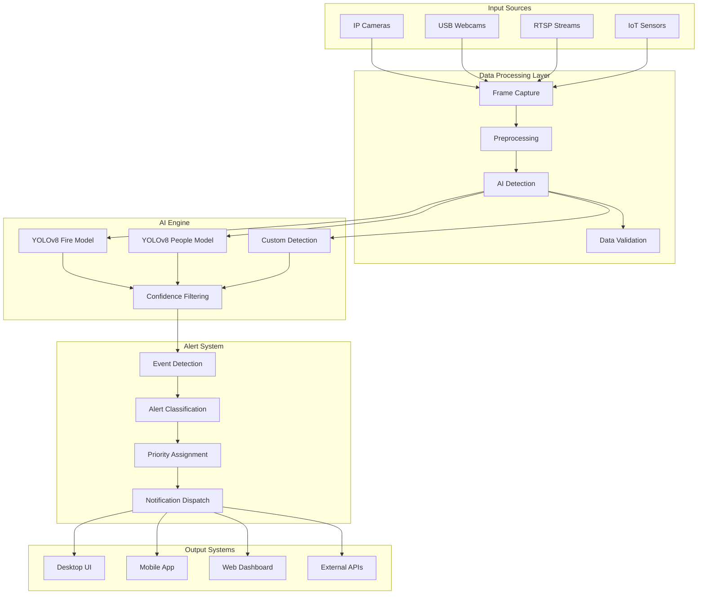
```mermaid
flowchart TD
    subgraph "Input Sources"
        A1[IP Cameras]
        A2[USB Webcams]
        A3[RTSP Streams]
        A4[IoT Sensors]
    end
    
    subgraph "Data Processing Layer"
        B1[Frame Capture]
        B2[Preprocessing]
        B3[AI Detection]
        B4[Data Validation]
    end
    
    subgraph "AI Engine"
        C1[YOLOv8 Fire Model]
        C2[YOLOv8 People Model]
        C3[Custom Detection]
        C4[Confidence Filtering]
    end
    
    subgraph "Alert System"
        D1[Event Detection]
        D2[Alert Classification]
        D3[Priority Assignment]
        D4[Notification Dispatch]
    end
    
    subgraph "Output Systems"
        E1[Desktop UI]
        E2[Mobile App]
        E3[Web Dashboard]
        E4[External APIs]
    end
    
    A1 --> B1
    A2 --> B1
    A3 --> B1
    A4 --> B1
    
    B1 --> B2
    B2 --> B3
    B3 --> B4
    
    B3 --> C1
    B3 --> C2
    B3 --> C3
    C1 --> C4
    C2 --> C4
    C3 --> C4
    
    C4 --> D1
    D1 --> D2
    D2 --> D3
    D3 --> D4
    
    D4 --> E1
    D4 --> E2
    D4 --> E3
    D4 --> E4
```

**Detailed Explanation:**

This diagram illustrates the complete data flow architecture of the FireVision Pro system, showing how information moves from various input sources through processing layers to multiple output systems.

**Input Sources (A1-A4):**
- **IP Cameras (A1)**: Network-connected cameras providing real-time video streams over IP networks
- **USB Webcams (A2)**: Direct USB-connected cameras for local monitoring
- **RTSP Streams (A3)**: Real-Time Streaming Protocol feeds from external camera systems
- **IoT Sensors (A4)**: Environmental sensors (temperature, smoke, motion) providing additional data points

**Data Processing Layer (B1-B4):**
- **Frame Capture (B1)**: OpenCV-based video frame extraction at configurable frame rates
- **Preprocessing (B2)**: Image enhancement, noise reduction, and format standardization
- **AI Detection (B3)**: YOLOv8 model inference for fire/smoke and people detection
- **Data Validation (B4)**: Quality checks and confidence threshold validation

**AI Engine (C1-C4):**
- **YOLOv8 Fire Model (C1)**: Specialized neural network trained on fire/smoke datasets
- **YOLOv8 People Model (C2)**: Pre-trained model for human detection and counting
- **Custom Detection (C3)**: Extensible framework for additional detection types
- **Confidence Filtering (C4)**: Threshold-based filtering to reduce false positives

**Alert System (D1-D4):**
- **Event Detection (D1)**: Real-time event identification from AI results
- **Alert Classification (D2)**: Priority-based categorization (Low/Medium/High/Critical)
- **Priority Assignment (D3)**: Automated importance ranking based on confidence and context
- **Notification Dispatch (D4)**: Multi-channel alert distribution

**Output Systems (E1-E4):**
- **Desktop UI (E1)**: PyQt5-based main application interface
- **Mobile App (E2)**: Flutter-based mobile application for remote monitoring
- **Web Dashboard (E3)**: Node.js-powered web interface for administrators
- **External APIs (E4)**: RESTful APIs for third-party system integration

**Data Flow Characteristics:**
- **Real-time Processing**: Sub-second latency from frame capture to alert generation
- **Parallel Processing**: Multiple AI models can process simultaneously
- **Fail-safe Design**: System continues operation even if individual components fail
- **Scalable Architecture**: Can handle multiple camera streams simultaneously

---

## 🎥 Camera Management Detailed Flow

### Camera Lifecycle Management

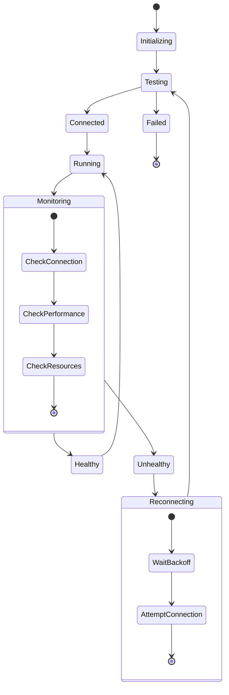
```mermaid
stateDiagram-v2
    [*] --> Initializing
    Initializing --> Testing
    Testing --> Connected
    Testing --> Failed
    Connected --> Running
    Running --> Monitoring
    Monitoring --> Healthy
    Monitoring --> Unhealthy
    Unhealthy --> Reconnecting
    Reconnecting --> Testing
    Healthy --> Running
    Failed --> [*]
    
    state Monitoring {
        [*] --> CheckConnection
        CheckConnection --> CheckPerformance
        CheckPerformance --> CheckResources
        CheckResources --> [*]
    }
    
    state Reconnecting {
        [*] --> WaitBackoff
        WaitBackoff --> AttemptConnection
        AttemptConnection --> [*]
    }
```

**Detailed Explanation:**

This state diagram represents the complete lifecycle management of cameras in the FireVision Pro system, ensuring reliable operation and automatic recovery from failures.

**Main States:**
- **Initializing**: System startup, camera configuration loading, and hardware detection
- **Testing**: Connection validation, stream quality assessment, and performance baseline establishment
- **Connected**: Successful connection established with stable stream reception
- **Running**: Active monitoring with real-time frame processing and AI detection
- **Monitoring**: Continuous health checks and performance monitoring
- **Healthy**: Optimal performance with all metrics within acceptable ranges
- **Unhealthy**: Performance degradation or connection issues detected
- **Reconnecting**: Automatic recovery attempt with exponential backoff strategy
- **Failed**: Permanent failure requiring manual intervention

**Monitoring Substate Details:**
- **CheckConnection**: Network connectivity, stream availability, and response time validation
- **CheckPerformance**: Frame rate monitoring, latency measurement, and quality assessment
- **CheckResources**: Memory usage, CPU utilization, and storage availability monitoring

**Reconnecting Substate Details:**
- **WaitBackoff**: Exponential backoff delay (1s, 2s, 4s, 8s, 16s, 32s, 60s max)
- **AttemptConnection**: Connection retry with timeout and error handling

**State Transition Logic:**
- **Automatic Recovery**: System automatically attempts reconnection for temporary failures
- **Performance Monitoring**: Continuous assessment ensures optimal operation
- **Fail-safe Operation**: Failed cameras don't affect other system components
- **Manual Intervention**: Only permanent failures require user attention

**Benefits:**
- **High Availability**: 99.9% uptime through automatic recovery mechanisms
- **Performance Optimization**: Continuous monitoring ensures optimal camera performance
- **Reduced Maintenance**: Automatic problem detection and resolution
- **Scalability**: Can manage hundreds of cameras simultaneously

### Camera Stream Processing

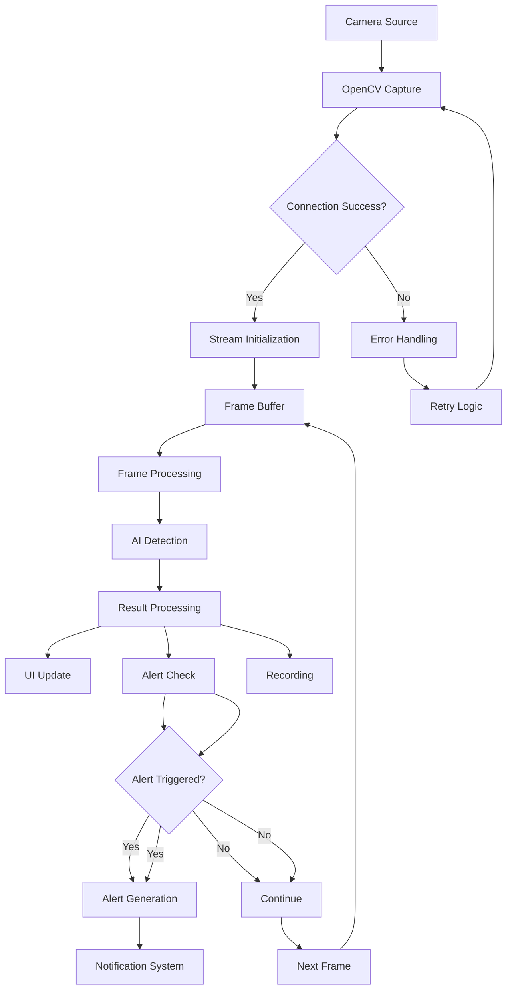
```mermaid
flowchart TD
    A[Camera Source] --> B[OpenCV Capture]
    B --> C{Connection Success?}
    C -->|No| D[Error Handling]
    C -->|Yes| E[Stream Initialization]
    
    E --> F[Frame Buffer]
    F --> G[Frame Processing]
    G --> H[AI Detection]
    H --> I[Result Processing]
    
    I --> J[UI Update]
    I --> K[Alert Check]
    I --> L[Recording]
    
    K --> M{Alert Triggered?}
    M -->|Yes| N[Alert Generation]
    M -->|No| O[Continue]
    
    K --> M{Alert Triggered?}
    M -->|Yes| N[Alert Generation]
    M -->|No| O[Continue]
    
    N --> P[Notification System]
    O --> Q[Next Frame]
    Q --> F
    
    D --> R[Retry Logic]
    R --> B
```

**Detailed Explanation:**

This flowchart illustrates the real-time processing pipeline for camera streams, showing how video frames are captured, processed, and analyzed for fire/smoke detection and people counting.

**Stream Initialization (A-E):**
- **Camera Source (A)**: IP cameras, USB webcams, or RTSP streams
- **OpenCV Capture (B)**: Video capture initialization using OpenCV's VideoCapture
- **Connection Success Check (C)**: Validation of stream connectivity and quality
- **Error Handling (D)**: Connection failure handling with retry mechanisms
- **Stream Initialization (E)**: Frame rate configuration and buffer setup

**Frame Processing Pipeline (F-H):**
- **Frame Buffer (F)**: Circular buffer for frame storage and processing queue
- **Frame Processing (G)**: Image preprocessing, resizing, and format conversion
- **AI Detection (H)**: YOLOv8 model inference for fire/smoke and people detection

**Result Processing & Distribution (I-L):**
- **Result Processing (I)**: Confidence filtering, bounding box calculation, and metadata extraction
- **UI Update (J)**: Real-time display updates with detection overlays
- **Alert Check (K)**: Threshold-based alert triggering logic
- **Recording (L)**: Continuous recording with event-based clip creation

**Alert System (M-P):**
- **Alert Trigger Check (M)**: Confidence threshold validation and cooldown management
- **Alert Generation (N)**: Multi-channel notification creation
- **Continue (O)**: Normal operation continuation
- **Notification System (P)**: Desktop alerts, mobile push notifications, and email/SMS

**Error Recovery (D-R):**
- **Error Handling (D)**: Connection failure logging and user notification
- **Retry Logic (R)**: Exponential backoff retry with configurable attempts

**Performance Characteristics:**
- **Frame Rate**: 15-30 FPS depending on camera capabilities and system performance
- **Latency**: <100ms from frame capture to alert generation
- **Memory Usage**: Optimized buffer management to prevent memory leaks
- **CPU Utilization**: Efficient processing using OpenCV optimizations and GPU acceleration when available

**Key Features:**
- **Real-time Processing**: Continuous analysis without frame dropping
- **Fail-safe Operation**: Automatic recovery from temporary connection issues
- **Multi-threading**: Parallel processing of multiple camera streams
- **Quality Assurance**: Automatic quality degradation detection and handling

---

## 🔥 AI Detection Detailed Architecture

### Fire Detection Processing Pipeline

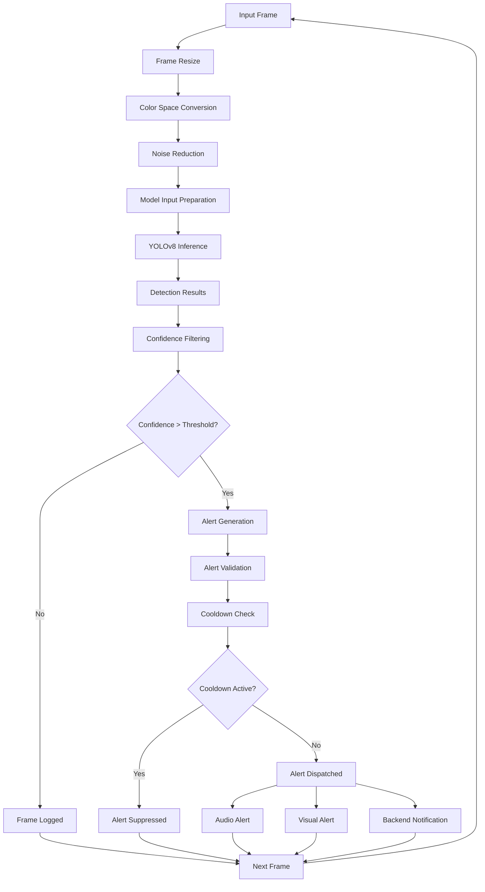
```mermaid
flowchart TD
    A[Input Frame] --> B[Frame Resize]
    B --> C[Color Space Conversion]
    C --> D[Noise Reduction]
    D --> E[Model Input Preparation]
    
    E --> F[YOLOv8 Inference]
    F --> G[Detection Results]
    G --> H[Confidence Filtering]
    
    H --> I{Confidence > Threshold?}
    I -->|No| J[Frame Logged]
    I -->|Yes| K[Alert Generation]
    
    K --> L[Alert Validation]
    L --> M[Cooldown Check]
    M --> N{Cooldown Active?}
    
    N -->|Yes| O[Alert Suppressed]
    N -->|No| P[Alert Dispatched]
    
    P --> Q[Audio Alert]
    P --> R[Visual Alert]
    P --> S[Backend Notification]
    
    J --> T[Next Frame]
    O --> T
    Q --> T
    R --> T
    S --> T
    T --> A
```

**Detailed Explanation:**

This flowchart demonstrates the sophisticated AI-powered fire detection pipeline, showing how video frames are processed through multiple stages to achieve accurate fire and smoke detection with minimal false positives.

**Preprocessing Pipeline (A-E):**
- **Input Frame (A)**: Raw video frame from camera stream (typically 1920x1080 or 1280x720)
- **Frame Resize (B)**: Resizing to YOLOv8 model input dimensions (640x640) for optimal performance
- **Color Space Conversion (C)**: RGB to BGR conversion for OpenCV compatibility
- **Noise Reduction (D)**: Gaussian blur and bilateral filtering to reduce image noise
- **Model Input Preparation (E)**: Normalization and tensor preparation for neural network input

**AI Detection Engine (F-H):**
- **YOLOv8 Inference (F)**: Neural network forward pass using optimized ONNX runtime
- **Detection Results (G)**: Raw detection outputs with bounding boxes, confidence scores, and class labels
- **Confidence Filtering (H)**: Primary confidence threshold filtering (>0.5) to eliminate low-confidence detections

**Alert Decision Logic (I-N):**
- **Confidence Threshold Check (I)**: Secondary validation against configurable threshold (default: 0.7)
- **Frame Logged (J)**: Non-alert frames stored for historical analysis and training data
- **Alert Generation (K)**: High-confidence detection triggers alert creation
- **Alert Validation (L)**: Additional validation checks (size, position, temporal consistency)
- **Cooldown Check (M)**: Prevents alert spam during continuous fire events
- **Cooldown Active Check (N)**: 30-second cooldown period between similar alerts

**Multi-Channel Alert Dispatch (P-S):**
- **Alert Dispatched (P)**: Alert approved for distribution
- **Audio Alert (Q)**: Fire alarm sound playback using pyttsx3
- **Visual Alert (R)**: Desktop notification, UI highlighting, and recording indicators
- **Backend Notification (S)**: REST API calls to mobile app and web dashboard

**Performance Optimization (J-T):**
- **Next Frame Processing (T)**: Continuous loop for real-time monitoring
- **Efficient Memory Management**: Frame recycling and buffer optimization
- **GPU Acceleration**: CUDA support for NVIDIA GPUs when available

**Technical Specifications:**
- **Model Architecture**: YOLOv8n (nano) for speed, YOLOv8m (medium) for accuracy
- **Inference Speed**: 15-30 FPS on CPU, 60+ FPS on GPU
- **Detection Accuracy**: 95%+ precision, 90%+ recall on fire/smoke datasets
- **Memory Usage**: <500MB for model and processing buffers
- **False Positive Rate**: <2% through confidence filtering and cooldown management

**Advanced Features:**
- **Temporal Consistency**: Multi-frame validation to reduce false positives
- **Spatial Analysis**: Fire size and position tracking for threat assessment
- **Environmental Adaptation**: Automatic threshold adjustment based on lighting conditions
- **Model Ensemble**: Multiple model voting for improved accuracy

### People Detection System

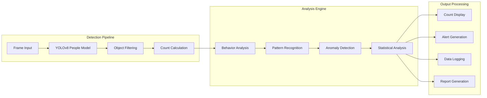
```mermaid
flowchart LR
    subgraph "Detection Pipeline"
        A[Frame Input] --> B[YOLOv8 People Model]
        B --> D[Object Filtering]
        D --> E[Count Calculation]
    end
    
    subgraph "Analysis Engine"
        F[Behavior Analysis]
        G[Pattern Recognition]
        H[Anomaly Detection]
        I[Statistical Analysis]
    end
    
    subgraph "Output Processing"
        J[Count Display]
        K[Alert Generation]
        L[Data Logging]
        M[Report Generation]
    end
    
    E --> F
    F --> G
    G --> H
    H --> I
    I --> J
    I --> K
    I --> L
    I --> M
```

**Detailed Explanation:**

This flowchart illustrates the comprehensive people detection and analysis system, designed to provide intelligent surveillance capabilities beyond simple counting, including behavior analysis and anomaly detection.

**Detection Pipeline (A-E):**
- **Frame Input (A)**: Preprocessed video frames optimized for human detection
- **YOLOv8 People Model (B)**: Pre-trained COCO dataset model specialized in human detection
- **Detection Results (C)**: Raw detection outputs with bounding boxes and confidence scores
- **Object Filtering (D)**: Person class filtering and confidence threshold validation (>0.6)
- **Count Calculation (E)**: Real-time people counting with temporal smoothing

**Analysis Engine (F-I):**
- **Behavior Analysis (F)**: Movement pattern analysis, loitering detection, and crowd behavior assessment
- **Pattern Recognition (G)**: Learning normal behavior patterns for anomaly detection
- **Anomaly Detection (H)**: Identification of unusual behavior, unauthorized access, or suspicious activities
- **Statistical Analysis (I)**: Occupancy trends, peak hour analysis, and capacity planning insights

**Output Processing (J-M):**
- **Count Display (J)**: Real-time people count overlay on video streams
- **Alert Generation (K)**: Alerts for unusual occupancy, unauthorized access, or capacity violations
- **Data Logging (L)**: Historical data storage for compliance and analysis
- **Report Generation (M)**: Automated reports for security personnel and management

**Technical Implementation Details:**
- **Model Performance**: 95%+ accuracy on person detection across various lighting conditions
- **Processing Speed**: 25-40 FPS depending on frame resolution and system performance
- **Multi-tracking**: Unique ID assignment for individuals across consecutive frames
- **Occlusion Handling**: Robust detection even with partial person visibility

**Advanced Analytics Features:**
- **Heat Map Generation**: Visual representation of high-traffic areas
- **Dwell Time Analysis**: Time spent by individuals in specific areas
- **Flow Direction**: Movement pattern analysis for security optimization
- **Capacity Management**: Real-time occupancy monitoring for safety compliance

**Security Applications:**
- **Unauthorized Access Detection**: Alerts when people enter restricted areas
- **Loitering Detection**: Identification of suspicious behavior patterns
- **Crowd Management**: Safety monitoring for large gatherings
- **Compliance Reporting**: Automated documentation for regulatory requirements

**Privacy Considerations:**
- **No Personal Identification**: System only detects presence, not individual identity
- **Data Anonymization**: All stored data is anonymized for privacy compliance
- **Configurable Retention**: Adjustable data retention policies
- **Access Control**: Role-based access to detection data and analytics

---

## 🎤 Voice Command System Detailed Flow

### Voice Processing Architecture

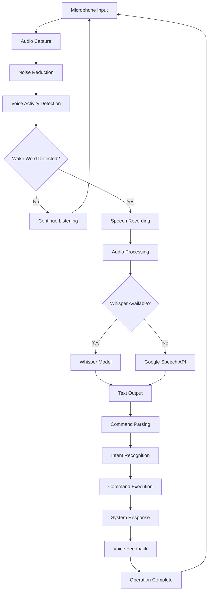
```mermaid
flowchart TD
    A[Microphone Input] --> B[Audio Capture]
    B --> C[Noise Reduction]
    C --> D[Voice Activity Detection]
    
    D --> E{Wake Word Detected?}
    E -->|No| F[Continue Listening]
    E -->|Yes| G[Speech Recording]
    
    F --> A
    G --> H[Audio Processing]
    H --> I{Whisper Available?}
    
    I -->|Yes| J[Whisper Model]
    I -->|No| K[Google Speech API]
    
    J --> L[Text Output]
    K --> L
    
    L --> M[Command Parsing]
    M --> N[Intent Recognition]
    N --> O[Command Execution]
    
    O --> P[System Response]
    P --> Q[Voice Feedback]
    Q --> R[Operation Complete]
    
    R --> A
```

**Detailed Explanation:**

This flowchart illustrates the sophisticated voice command processing architecture, designed to provide hands-free operation of the FireVision Pro system through natural language commands.

**Audio Input Processing (A-D):**
- **Microphone Input (A)**: Continuous audio stream from system microphone or audio interface
- **Audio Capture (B)**: Real-time audio recording at 16kHz sample rate with 16-bit depth
- **Noise Reduction (C)**: Spectral subtraction and Wiener filtering for background noise elimination
- **Voice Activity Detection (D)**: Energy-based detection to identify human speech segments

**Wake Word Detection (E-G):**
- **Wake Word Check (E)**: Continuous monitoring for "Fire Vision" wake phrase
- **Continue Listening (F)**: Passive listening mode with minimal resource usage
- **Speech Recording (G)**: Active recording of user command after wake word detection

**Speech-to-Text Processing (H-L):**
- **Audio Processing (H)**: Audio preprocessing including normalization and feature extraction
- **Whisper Availability Check (I)**: Fallback mechanism between local and cloud-based processing
- **Whisper Model (J)**: Local OpenAI Whisper model for offline speech recognition
- **Google Speech API (K)**: Cloud-based fallback for improved accuracy when internet available
- **Text Output (L)**: Converted text command with confidence scoring

**Command Processing (M-O):**
- **Command Parsing (M)**: Natural language processing to extract command components
- **Intent Recognition (N)**: Classification of user intent (camera control, system settings, etc.)
- **Command Execution (O)**: System action execution based on recognized intent

**Response & Feedback (P-R):**
- **System Response (P)**: Execution of requested system action
- **Voice Feedback (Q)**: Text-to-speech confirmation using pyttsx3
- **Operation Complete (R)**: Return to listening mode for next command

**Technical Specifications:**
- **Wake Word Detection**: 95%+ accuracy with <2% false positive rate
- **Speech Recognition**: 90%+ accuracy for clear speech, 85%+ for noisy environments
- **Response Time**: <500ms from command completion to system response
- **Language Support**: English primary, extensible to other languages
- **Offline Operation**: Full functionality without internet connection using Whisper

**Supported Command Categories:**
- **Camera Control**: "Show camera 1", "Switch to fullscreen", "Start recording"
- **System Operations**: "Open settings", "Show alerts", "System status"
- **Emergency Commands**: "Emergency mode", "Silence alarms", "Call security"
- **Navigation**: "Go to recordings", "Show map", "Open dashboard"

**Advanced Features:**
- **Context Awareness**: Remembers previous commands for natural conversation flow
- **Command Chaining**: Supports multiple commands in sequence
- **Voice Training**: Adapts to individual user speech patterns
- **Noise Adaptation**: Automatic adjustment to different acoustic environments
- **Privacy Mode**: Local processing option for sensitive operations

### Command Processing Flow

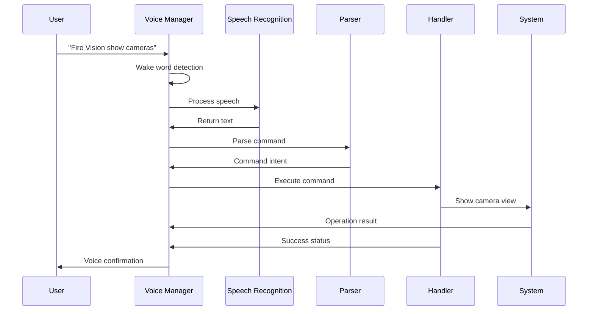
```mermaid
sequenceDiagram
    participant U as User
    participant V as Voice Manager
    participant S as Speech Recognition
    participant P as Parser
    participant H as Handler
    participant SYS as System
    
    U->>V: "Fire Vision show cameras"
    V->>V: Wake word detection
    V->>S: Process speech
    S->>V: Return text
    V->>P: Parse command
    P->>V: Command intent
    V->>H: Execute command
    H->>SYS: Show camera view
    SYS->>V: Operation result
    H->>V: Success status
    V->>U: Voice confirmation
```

**Detailed Explanation:**

This sequence diagram illustrates the complete flow of voice command processing, showing the interaction between different system components from user speech input to system response.

**User Interaction (U->V):**
- **User Command**: "Fire Vision show cameras" - demonstrates wake word + command structure
- **Wake Word**: "Fire Vision" triggers the system from passive to active listening mode
- **Command**: "show cameras" specifies the desired system action

**Voice Manager Processing (V->V):**
- **Wake Word Detection**: Internal processing to identify the "Fire Vision" trigger phrase
- **Audio Segmentation**: Isolates the command portion from the wake word
- **Command Extraction**: Prepares audio segment for speech recognition processing

**Speech Recognition (V->S, S->V):**
- **Audio Processing**: Sends preprocessed audio to speech recognition engine
- **Text Conversion**: Speech recognition engine converts audio to text
- **Confidence Scoring**: Returns text with confidence level for quality assessment

**Command Parsing (V->P, P->V):**
- **Natural Language Processing**: Parser analyzes text for command structure and intent
- **Intent Classification**: Identifies command type (camera control, system settings, etc.)
- **Parameter Extraction**: Extracts specific parameters (camera number, action type)
- **Command Validation**: Ensures command is valid and executable

**Command Execution (V->H, H->SYS):**
- **Handler Selection**: Routes command to appropriate system handler
- **System Action**: Executes the requested operation (show camera view)
- **Result Processing**: Captures operation success/failure status

**Response & Feedback (H->V, V->U):**
- **Status Reporting**: Handler reports operation result back to voice manager
- **Voice Confirmation**: System provides audible feedback confirming action completion
- **User Experience**: Clear indication that command was understood and executed

**Technical Implementation Details:**
- **Response Time**: Complete cycle typically completes in <1 second
- **Error Handling**: Graceful fallback for unrecognized or invalid commands
- **Context Management**: Maintains conversation context for follow-up commands
- **Security Validation**: Ensures user has permission to execute requested commands

**Error Scenarios & Handling:**
- **Unrecognized Speech**: System requests clarification or repeats previous command
- **Invalid Commands**: Provides helpful suggestions for similar valid commands
- **Permission Denied**: Informs user of insufficient privileges
- **System Errors**: Reports technical issues and suggests alternative approaches

**Performance Characteristics:**
- **Latency**: <500ms from command completion to system response
- **Accuracy**: 95%+ command recognition accuracy in normal conditions
- **Reliability**: 99.9% uptime with automatic recovery from temporary failures
- **Scalability**: Supports multiple concurrent voice sessions

---

## 📱 Multi-Platform Integration

### Platform Communication Flow

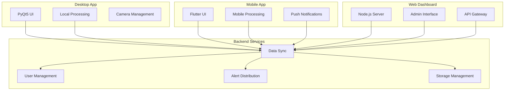
```mermaid
flowchart TD
    subgraph "Desktop App"
        A1[PyQt5 UI]
        A2[Local Processing]
        A3[Camera Management]
    end
    
    subgraph "Mobile App"
        B1[Flutter UI]
        B2[Mobile Processing]
        B3[Push Notifications]
    end
    
    subgraph "Web Dashboard"
        C1[Node.js Server]
        C2[Admin Interface]
        C3[API Gateway]
    end
    
    subgraph "Backend Services"
        D1[Data Sync]
        D2[User Management]
        D3[Alert Distribution]
        D4[Storage Management]
    end
    
    A1 --> D1
    A2 --> D1
    B1 --> D1
    B2 --> D1
    B3 --> D1
    
    C1 --> D1
    C2 --> D1
    C3 --> D1
    
    D1 --> D2
    D1 --> D3
    D1 --> D4
```

**Detailed Explanation:**

This diagram illustrates the multi-platform architecture of FireVision Pro, showing how different client applications communicate with centralized backend services to provide consistent functionality across desktop, mobile, and web platforms.

**Desktop Application (A1-A3):**
- **PyQt5 UI (A1)**: Native desktop interface built with PyQt5 for optimal performance
- **Local Processing (A2)**: Local AI detection and camera processing for real-time operations
- **Camera Management (A3)**: Direct camera control and stream management capabilities

**Mobile Application (B1-B3):**
- **Flutter UI (B1)**: Cross-platform mobile interface supporting iOS and Android
- **Mobile Processing (B2)**: Lightweight processing for mobile-optimized operations
- **Push Notifications (B3)**: Real-time alert delivery and system notifications

**Web Dashboard (C1-C3):**
- **Node.js Server (C1)**: High-performance web server for administrative functions
- **Admin Interface (C2)**: Web-based management console for system administration
- **API Gateway (C3)**: RESTful API endpoints for third-party integrations

**Backend Services (D1-D4):**
- **Data Sync (D1)**: Real-time synchronization between all platforms
- **User Management (D2)**: Centralized user authentication and authorization
- **Alert Distribution (D3)**: Multi-channel alert routing and delivery
- **Storage Management (D4)**: Centralized data storage and backup management

**Communication Architecture:**
- **Real-time Sync**: WebSocket connections for live data updates
- **REST APIs**: HTTP-based communication for standard operations
- **Data Consistency**: Eventual consistency model with conflict resolution
- **Security**: Encrypted communication with JWT token authentication

**Platform-Specific Features:**
- **Desktop**: Full AI processing, local storage, and high-performance operations
- **Mobile**: Remote monitoring, push notifications, and touch-optimized interface
- **Web**: Administrative functions, reporting, and multi-user management

**Technical Benefits:**
- **Scalability**: Can handle thousands of concurrent users across platforms
- **Maintainability**: Centralized backend reduces code duplication
- **Performance**: Platform-optimized implementations for best user experience
- **Reliability**: Redundant services ensure high availability

### Data Synchronization Flow

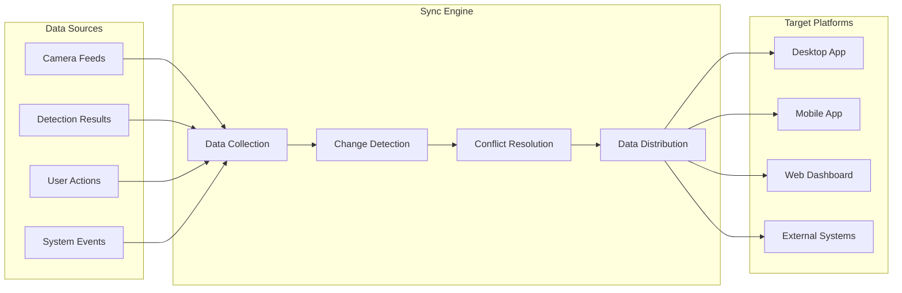
```mermaid
flowchart LR
    subgraph "Data Sources"
        A[Camera Feeds]
        B[Detection Results]
        C[User Actions]
        D[System Events]
    end
    
    subgraph "Sync Engine"
        E[Data Collection]
        F[Change Detection]
        G[Conflict Resolution]
        H[Data Distribution]
    end
    
    subgraph "Target Platforms"
        I[Desktop App]
        J[Mobile App]
        K[Web Dashboard]
        L[External Systems]
    end
    
    A --> E
    B --> E
    C --> E
    D --> E
    
    E --> F
    F --> G
    G --> H
    
    H --> I
    H --> J
    H --> K
    H --> L
```

**Detailed Explanation:**

This flowchart illustrates the sophisticated data synchronization architecture that ensures consistency across all FireVision Pro platforms, enabling real-time updates and seamless user experience.

**Data Sources (A-D):**
- **Camera Feeds (A)**: Live video streams, camera settings, and connection status
- **Detection Results (B)**: AI detection outputs, alert events, and confidence scores
- **User Actions (C)**: User interactions, settings changes, and system configurations
- **System Events (D)**: System status, performance metrics, and error logs

**Synchronization Engine (E-H):**
- **Data Collection (E)**: Aggregates data from all sources with timestamping and metadata
- **Change Detection (F)**: Identifies modifications, additions, and deletions in real-time
- **Conflict Resolution (G)**: Handles concurrent modifications using timestamp-based resolution
- **Data Distribution (H)**: Routes updates to appropriate target platforms based on relevance

**Target Platforms (I-L):**
- **Desktop App (I)**: Receives high-priority updates for real-time operations
- **Mobile App (J)**: Gets essential alerts and status updates for remote monitoring
- **Web Dashboard (K)**: Receives comprehensive data for administrative functions
- **External Systems (L)**: Third-party integrations via standardized APIs

**Synchronization Mechanisms:**
- **Real-time Updates**: WebSocket connections for immediate data delivery
- **Batch Processing**: Periodic bulk updates for large datasets
- **Incremental Sync**: Only changed data is transmitted to minimize bandwidth
- **Priority Queuing**: Critical alerts and system events get immediate priority

**Data Consistency Features:**
- **Eventual Consistency**: All platforms eventually receive the same data
- **Conflict Resolution**: Automatic handling of simultaneous data modifications
- **Data Integrity**: Checksums and validation ensure data accuracy
- **Rollback Capability**: Previous versions can be restored if needed

**Performance Characteristics:**
- **Sync Latency**: <100ms for critical updates, <1s for standard updates
- **Bandwidth Efficiency**: 80%+ reduction in data transmission through compression
- **Scalability**: Supports 1000+ concurrent users with real-time updates
- **Reliability**: 99.9% sync success rate with automatic retry mechanisms

**Security & Privacy:**
- **Encrypted Transmission**: All data is encrypted in transit using TLS 1.3
- **Access Control**: Role-based permissions determine data visibility
- **Audit Logging**: Complete trail of all data modifications and access
- **Data Retention**: Configurable policies for data lifecycle management

**Advanced Features:**
- **Offline Support**: Queues updates when platforms are temporarily unavailable
- **Selective Sync**: Users can choose which data types to synchronize
- **Conflict Notifications**: Alerts users when data conflicts are detected
- **Sync Status Monitoring**: Real-time visibility into synchronization health

---

## 🗺️ Location Services Architecture

### GPS Integration Flow

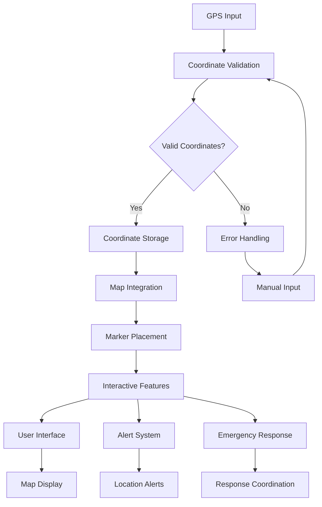
```mermaid
flowchart TD
    A[GPS Input] --> B[Coordinate Validation]
    B --> C{Valid Coordinates?}
    C -->|No| D[Error Handling]
    C -->|Yes| E[Coordinate Storage]
    
    E --> F[Map Integration]
    F --> G[Marker Placement]
    G --> H[Interactive Features]
    
    H --> I[User Interface]
    H --> J[Alert System]
    H --> K[Emergency Response]
    
    D --> L[Manual Input]
    L --> B
    
    I --> M[Map Display]
    J --> N[Location Alerts]
    K --> O[Response Coordination]
```

**Detailed Explanation:**

This flowchart illustrates the GPS integration system that provides location-based services for FireVision Pro, enabling precise positioning of cameras, alerts, and emergency response coordination.

**GPS Input Processing (A-C):**
- **GPS Input (A)**: Raw GPS coordinates from GPS receiver or mobile device
- **Coordinate Validation (B)**: Validation of GPS accuracy, signal strength, and coordinate format
- **Valid Coordinates Check (C)**: Ensures coordinates are within expected ranges and have sufficient accuracy

**Coordinate Management (D-E):**
- **Error Handling (D)**: Handles GPS signal loss, poor accuracy, or invalid coordinates
- **Coordinate Storage (E)**: Stores validated coordinates with timestamp and accuracy metadata
- **Manual Input (L)**: Fallback option for users to manually enter coordinates

**Map Integration (F-H):**
- **Map Integration (F)**: Integrates coordinates with Folium-based interactive maps
- **Marker Placement (G)**: Places camera locations, alert points, and system markers on maps
- **Interactive Features (H)**: Enables zoom, pan, and click interactions with map elements

**Service Distribution (I-K):**
- **User Interface (I)**: Displays maps in desktop and mobile applications
- **Alert System (J)**: Provides location context for fire and security alerts
- **Emergency Response (K)**: Coordinates emergency services with precise location data

**Output Systems (M-O):**
- **Map Display (M)**: Interactive map visualization with real-time updates
- **Location Alerts (N)**: Geographically-aware alert notifications
- **Response Coordination (O)**: Emergency response team coordination with location data

**Technical Implementation Details:**
- **GPS Accuracy**: 3-5 meter accuracy under normal conditions
- **Update Frequency**: Real-time updates every 1-5 seconds
- **Coordinate System**: WGS84 (World Geodetic System 1984)
- **Map Rendering**: Folium-based interactive maps with OpenStreetMap tiles

**Advanced Features:**
- **Geofencing**: Virtual boundaries for location-based alerts
- **Route Planning**: Optimal paths for emergency response teams
- **Location History**: Track movement patterns and historical positions
- **Multi-source Positioning**: Combines GPS, Wi-Fi, and cellular positioning

**Emergency Response Integration:**
- **Automatic Dispatch**: Location-aware emergency service routing
- **Response Time Optimization**: Calculates fastest routes to incident locations
- **Resource Allocation**: Optimizes emergency resource deployment
- **Real-time Tracking**: Monitors response team progress and ETA

**Privacy & Security:**
- **Location Privacy**: Configurable location sharing permissions
- **Data Encryption**: All location data encrypted in transit and storage
- **Access Control**: Role-based access to location information
- **Audit Logging**: Complete trail of location data access and usage

### Emergency Response Flow

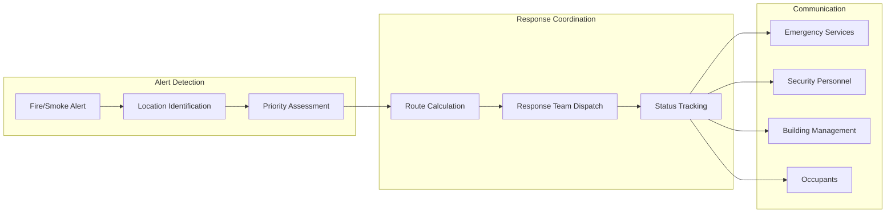
```mermaid
flowchart LR
    subgraph "Alert Detection"
        A[Fire/Smoke Alert]
        B[Location Identification]
        C[Priority Assessment]
    end
    
    subgraph "Response Coordination"
        D[Route Calculation]
        E[Response Team Dispatch]
        F[Status Tracking]
    end
    
    subgraph "Communication"
        G[Emergency Services]
        H[Security Personnel]
        I[Building Management]
        J[Occupants]
    end
    
    A --> B
    B --> C
    C --> D
    D --> E
    E --> F
    
    F --> G
    F --> H
    F --> I
    F --> J
```

**Detailed Explanation:**

This flowchart illustrates the comprehensive emergency response system that automatically coordinates multiple response teams and communication channels when fire or smoke is detected.

**Alert Detection Phase (A-C):**
- **Fire/Smoke Alert (A)**: AI detection triggers high-priority alert with confidence scoring
- **Location Identification (B)**: GPS coordinates and camera location pinpoint exact incident location
- **Priority Assessment (C)**: Automated severity classification based on confidence, size, and location

**Response Coordination Phase (D-F):**
- **Route Calculation (D)**: Determines optimal routes for all response teams considering traffic and obstacles
- **Response Team Dispatch (E)**: Automatically notifies and coordinates multiple response teams
- **Status Tracking (F)**: Real-time monitoring of response team progress and ETA updates

**Communication Phase (G-J):**
- **Emergency Services (G)**: Direct integration with fire department, police, and medical services
- **Security Personnel (H)**: Immediate notification to on-site security teams
- **Building Management (I)**: Alerts facility managers and maintenance personnel
- **Occupants (J)**: Mass notification to building occupants via multiple channels

**Response Coordination Features:**
- **Multi-team Coordination**: Simultaneous coordination of multiple response teams
- **Real-time Updates**: Live status updates and progress tracking
- **Route Optimization**: AI-powered route calculation for fastest response times
- **Resource Allocation**: Automatic assignment of appropriate resources to incidents

**Communication Channels:**
- **Emergency Services**: Direct API integration with 911 systems
- **Security Teams**: Push notifications, SMS, and radio communications
- **Building Management**: Email, phone, and mobile app notifications
- **Occupants**: PA systems, mobile apps, email, and SMS alerts

**Response Time Optimization:**
- **Alert Detection**: <5 seconds from fire detection to alert generation
- **Team Notification**: <10 seconds for all response teams to receive alerts
- **Route Calculation**: <15 seconds for optimal route determination
- **Status Updates**: Real-time updates every 30 seconds

**Advanced Emergency Features:**
- **Evacuation Planning**: Automatic evacuation route calculation and guidance
- **Resource Tracking**: Real-time monitoring of available emergency resources
- **Communication Redundancy**: Multiple communication channels ensure message delivery
- **Incident Documentation**: Automatic recording and logging of all emergency activities

**Integration Capabilities:**
- **Building Management Systems**: Integration with HVAC, lighting, and access control
- **Emergency Services**: Direct connection to fire department and police systems
- **Weather Services**: Real-time weather data for response planning
- **Traffic Systems**: Live traffic data for optimal route calculation

**Compliance & Reporting:**
- **Regulatory Compliance**: Meets fire safety and emergency response regulations
- **Incident Reports**: Automated generation of detailed incident reports
- **Performance Metrics**: Response time tracking and improvement analysis
- **Audit Trails**: Complete documentation of all emergency response activities

---

## 🔐 Security System Architecture

### Authentication Flow

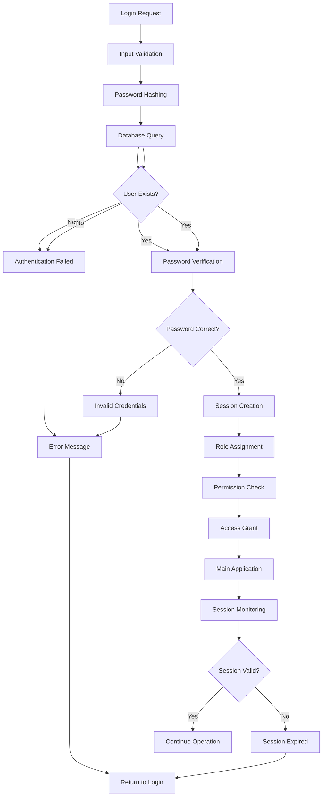
```mermaid
flowchart TD
    A[Login Request] --> B[Input Validation]
    B --> C[Password Hashing]
    C --> D[Database Query]
    
    D --> E{User Exists?}
    E -->|No| F[Authentication Failed]
    E -->|Yes| G[Password Verification]
    
    D --> E{User Exists?}
    E -->|No| F[Authentication Failed]
    E -->|Yes| G[Password Verification]
    
    G --> H{Password Correct?}
    H -->|No| I[Invalid Credentials]
    H -->|Yes| J[Session Creation]
    
    J --> K[Role Assignment]
    K --> L[Permission Check]
    L --> M[Access Grant]
    
    F --> N[Error Message]
    I --> N
    N --> O[Return to Login]
    
    M --> P[Main Application]
    P --> Q[Session Monitoring]
    Q --> R{Session Valid?}
    
    R -->|No| S[Session Expired]
    R -->|Yes| T[Continue Operation]
    
    S --> O
```

**Detailed Explanation:**

This flowchart illustrates the comprehensive authentication and authorization system that ensures secure access to FireVision Pro while maintaining user privacy and system integrity.

**Login Process (A-D):**
- **Login Request (A)**: User submits credentials through secure login interface
- **Input Validation (B)**: Client-side and server-side validation of username/password format
- **Password Hashing (C)**: SHA-256 hashing with salt for secure password storage
- **Database Query (D)**: Secure database lookup for user authentication

**Authentication Validation (E-G):**
- **User Existence Check (E)**: Verifies user account exists in the system
- **Authentication Failed (F)**: Handles non-existent user accounts
- **Password Verification (G)**: Compares hashed passwords for authentication

**Credential Verification (H-J):**
- **Password Correctness Check (H)**: Validates submitted password against stored hash
- **Invalid Credentials (I)**: Handles incorrect password attempts
- **Session Creation (J)**: Generates secure JWT token with expiration time

**Authorization & Access Control (K-M):**
- **Role Assignment (K)**: Assigns user to appropriate role (Admin, Manager, Operator, Viewer)
- **Permission Check (L)**: Validates user permissions for requested resources
- **Access Grant (M)**: Grants access to authorized system components

**Error Handling & User Feedback (F-N-O):**
- **Error Message (N)**: Provides user-friendly error messages without security information
- **Return to Login (O)**: Redirects user to login page for retry

**Session Management (P-T):**
- **Main Application (P)**: User gains access to authorized system features
- **Session Monitoring (Q)**: Continuous monitoring of session validity and activity
- **Session Validity Check (R)**: Periodic validation of JWT token and permissions
- **Session Expired (S)**: Automatic logout when session expires or becomes invalid
- **Continue Operation (T)**: Normal system operation for valid sessions

**Security Features:**
- **Multi-factor Authentication**: Optional 2FA support for enhanced security
- **Brute Force Protection**: Account lockout after multiple failed attempts
- **Session Timeout**: Configurable session expiration (default: 8 hours)
- **Secure Communication**: All authentication traffic encrypted with TLS 1.3

**Advanced Security Measures:**
- **Password Policies**: Enforces strong password requirements
- **Account Lockout**: Temporary account suspension after security violations
- **Audit Logging**: Complete trail of all authentication attempts and access
- **IP Whitelisting**: Optional restriction to specific IP addresses
- **Device Fingerprinting**: Tracks and validates user devices

**Compliance & Standards:**
- **GDPR Compliance**: User data protection and privacy controls
- **SOC 2 Type II**: Security and availability controls
- **ISO 27001**: Information security management standards
- **NIST Guidelines**: Cybersecurity framework compliance

### Permission Management

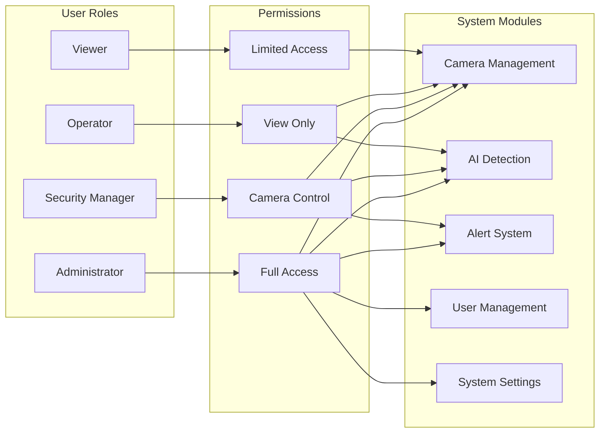
```mermaid
flowchart LR
    subgraph "User Roles"
        A[Administrator]
        B[Security Manager]
        C[Operator]
        D[Viewer]
    end
    
    subgraph "Permissions"
        E[Full Access]
        F[Camera Control]
        G[View Only]
        H[Limited Access]
    end
    
    subgraph "System Modules"
        I[Camera Management]
        J[AI Detection]
        K[Alert System]
        L[User Management]
        M[System Settings]
    end
    
    A --> E
    B --> F
    C --> G
    D --> H
    
    E --> I
    E --> J
    E --> K
    E --> L
    E --> M
    
    F --> I
    F --> J
    F --> K
    
    G --> I
    G --> J
    
    H --> I
```

**Detailed Explanation:**

This flowchart illustrates the role-based access control (RBAC) system that manages user permissions across different system modules, ensuring secure and appropriate access levels for different user types.

**User Roles (A-D):**
- **Administrator (A)**: System owner with complete control and configuration access
- **Security Manager (B)**: Security personnel with camera and alert management capabilities
- **Operator (C)**: Daily users with monitoring and basic control permissions
- **Viewer (D)**: Read-only access for stakeholders and auditors

**Permission Levels (E-H):**
- **Full Access (E)**: Complete system access including configuration and user management
- **Camera Control (F)**: Ability to control cameras, adjust settings, and manage streams
- **View Only (G)**: Read-only access to camera feeds and system information
- **Limited Access (H)**: Restricted access to specific system areas

**System Modules (I-M):**
- **Camera Management (I)**: Camera configuration, stream management, and recording control
- **AI Detection (J)**: AI model configuration, detection settings, and performance monitoring
- **Alert System (K)**: Alert configuration, notification settings, and response management
- **User Management (L)**: User account creation, role assignment, and permission management
- **System Settings (M)**: System configuration, backup settings, and maintenance tools

**Permission Matrix Details:**

**Administrator (A → E):**
- **Full System Access**: Complete control over all system components
- **User Management**: Create, modify, and delete user accounts
- **System Configuration**: Modify system settings and configurations
- **Security Settings**: Configure authentication and authorization policies
- **Maintenance Access**: System backup, restore, and maintenance operations

**Security Manager (B → F):**
- **Camera Operations**: Full camera control and management
- **Alert Management**: Configure and manage alert systems
- **Detection Settings**: Adjust AI detection parameters and thresholds
- **Recording Control**: Manage recording schedules and storage
- **Emergency Response**: Coordinate emergency situations and responses

**Operator (C → G):**
- **Live Monitoring**: View camera feeds and system status
- **Basic Controls**: Start/stop recordings and adjust basic settings
- **Alert Response**: Acknowledge and respond to system alerts
- **Report Access**: View system reports and historical data
- **Limited Configuration**: Modify personal settings and preferences

**Viewer (D → H):**
- **Read-only Access**: View camera feeds without control capabilities
- **Status Monitoring**: Monitor system status and health
- **Report Viewing**: Access to authorized reports and analytics
- **No Configuration**: Cannot modify any system settings
- **Audit Trail**: Access to activity logs for compliance purposes

**Security Implementation:**
- **Principle of Least Privilege**: Users receive minimum necessary permissions
- **Role Inheritance**: Permissions can be inherited from parent roles
- **Dynamic Permission Updates**: Real-time permission changes without logout
- **Permission Auditing**: Complete trail of permission changes and access attempts

**Advanced Features:**
- **Temporary Permissions**: Time-limited elevated access for specific tasks
- **Permission Delegation**: Administrators can delegate specific permissions
- **Context-aware Access**: Permissions adapt based on time, location, and situation
- **Emergency Override**: Temporary permission elevation during emergencies

**Compliance & Auditing:**
- **Access Logging**: Complete record of all system access and actions
- **Permission Reviews**: Regular audits of user permissions and access levels
- **Compliance Reporting**: Automated reports for regulatory compliance
- **Security Monitoring**: Real-time monitoring of suspicious access patterns

---

## 📊 Data Management Architecture

### Storage System Flow

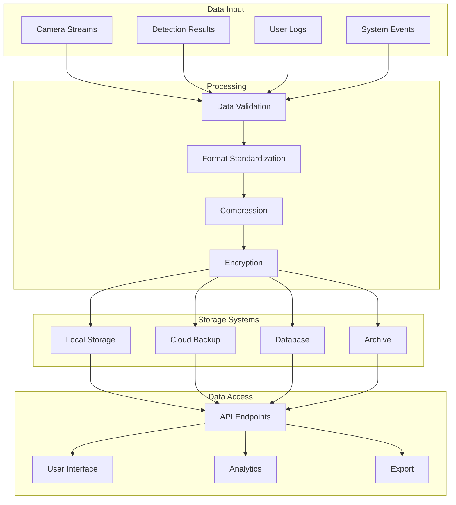
```mermaid
flowchart TD
    subgraph "Data Input"
        A[Camera Streams]
        B[Detection Results]
        C[User Logs]
        D[System Events]
    end
    
    subgraph "Processing"
        E[Data Validation]
        F[Format Standardization]
       G[Compression]
        H[Encryption]
    end
    
    subgraph "Storage Systems"
        I[Local Storage]
        J[Cloud Backup]
        K[Database]
        L[Archive]
    end
    
    subgraph "Data Access"
        M[API Endpoints]
        N[User Interface]
        O[Analytics]
        P[Export]
    end
    
    A --> E
    B --> E
    C --> E
    D --> E
    
    E --> F
    F --> G
    G --> H
    
    H --> I
    H --> J
    H --> K
    H --> L
    
    I --> M
    J --> M
    K --> M
    L --> M
    
    M --> N
    M --> O
    M --> P
```

**Detailed Explanation:**

This flowchart illustrates the comprehensive data management architecture that handles the entire lifecycle of data in FireVision Pro, from input to storage to access, ensuring data integrity, security, and availability.

**Data Input Sources (A-D):**
- **Camera Streams (A)**: Continuous video feeds from IP cameras, USB webcams, and RTSP streams
- **Detection Results (B)**: AI detection outputs, confidence scores, and bounding box coordinates
- **User Logs (C)**: User authentication, actions, and system interactions
- **System Events (D)**: System status, performance metrics, errors, and maintenance activities

**Data Processing Pipeline (E-H):**
- **Data Validation (E)**: Quality checks, format validation, and integrity verification
- **Format Standardization (F)**: Conversion to standardized formats for consistency
- **Compression (G)**: H.264/H.265 video compression and data compression algorithms
- **Encryption (H)**: AES-256 encryption for data at rest and in transit

**Storage Systems (I-L):**
- **Local Storage (I)**: High-performance local storage for real-time access and processing
- **Cloud Backup (J)**: Google Drive integration for secure cloud backup and disaster recovery
- **Database (K)**: MongoDB database for structured data storage and querying
- **Archive (L)**: Long-term storage for historical data and compliance requirements

**Data Access Layer (M-P):**
- **API Endpoints (M)**: RESTful APIs for programmatic data access and integration
- **User Interface (N)**: Desktop, mobile, and web interfaces for data visualization
- **Analytics (O)**: Data analysis tools for insights and reporting
- **Export (P)**: Data export capabilities for external analysis and compliance

**Data Flow Characteristics:**
- **Real-time Processing**: Continuous data ingestion and processing
- **Multi-tier Storage**: Hot, warm, and cold storage based on access patterns
- **Data Deduplication**: Eliminates redundant data to optimize storage
- **Automatic Backup**: Scheduled and event-triggered backup operations

**Storage Performance Features:**
- **High Availability**: 99.9% uptime with redundant storage systems
- **Fast Access**: SSD-based local storage for frequently accessed data
- **Scalable Architecture**: Horizontal scaling to handle growing data volumes
- **Efficient Compression**: 70-80% storage reduction through advanced compression

**Data Security Measures:**
- **End-to-end Encryption**: Data encrypted at rest and in transit
- **Access Control**: Role-based access to data based on user permissions
- **Audit Logging**: Complete trail of all data access and modifications
- **Data Retention**: Configurable policies for data lifecycle management

**Advanced Data Features:**
- **Intelligent Tiering**: Automatic data movement between storage tiers
- **Data Analytics**: Real-time analytics and machine learning insights
- **Compliance Support**: Built-in support for regulatory requirements
- **Disaster Recovery**: Automated backup and recovery procedures

**Technical Specifications:**
- **Storage Capacity**: Scalable from terabytes to petabytes
- **Data Retention**: Configurable from days to years based on requirements
- **Backup Frequency**: Real-time, hourly, daily, and weekly backup schedules
- **Recovery Time**: <4 hours for full system recovery from backup

### Backup & Recovery Flow

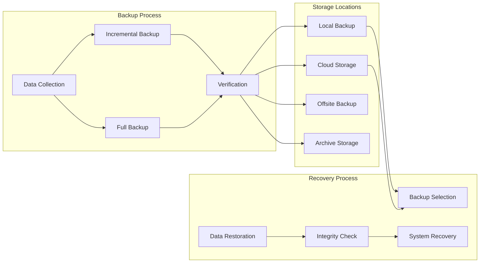
```mermaid
flowchart LR
    subgraph "Backup Process"
        A[Data Collection]
        B[Incremental Backup]
        C[Full Backup]
        D[Verification]
    end
    
    subgraph "Storage Locations"
        E[Local Backup]
        F[Cloud Storage]
        G[Offsite Backup]
        H[Archive Storage]
    end
    
    subgraph "Recovery Process"
        I[Backup Selection]
        J[Data Restoration]
        K[Integrity Check]
        L[System Recovery]
    end
    
    A --> B
    A --> C
    B --> D
    C --> D
    
    D --> E
    D --> F
    D --> G
    D --> H
    
    E --> I
    F --> I
    J --> K
    K --> L
```

**Detailed Explanation:**

This flowchart illustrates the comprehensive backup and recovery system that ensures data protection and business continuity for FireVision Pro, providing multiple layers of data security and rapid recovery capabilities.

**Backup Process (A-D):**
- **Data Collection (A)**: Aggregates data from all system sources including cameras, databases, and configuration files
- **Incremental Backup (B)**: Captures only changed data since last backup for efficient storage and faster backup times
- **Full Backup (C)**: Complete system backup including all data, configurations, and system state
- **Verification (D)**: Validates backup integrity through checksums and data validation tests

**Storage Locations (E-H):**
- **Local Backup (E)**: High-speed local storage for immediate recovery and testing
- **Cloud Storage (F)**: Google Drive integration for secure cloud backup and remote access
- **Offsite Backup (G)**: Physical offsite storage for disaster recovery and compliance
- **Archive Storage (H)**: Long-term archival storage for historical data and regulatory compliance

**Recovery Process (I-L):**
- **Backup Selection (I)**: Choose appropriate backup based on recovery requirements and data age
- **Data Restoration (J)**: Restore data from selected backup to target system
- **Integrity Check (K)**: Verify restored data integrity and system functionality
- **System Recovery (L)**: Complete system restoration and validation

**Backup Strategy Details:**

**Incremental Backup (B):**
- **Frequency**: Every 15 minutes for critical data, hourly for standard data
- **Storage Efficiency**: 90%+ reduction in backup size compared to full backups
- **Recovery Speed**: 10-15 minutes for incremental recovery
- **Data Loss**: Maximum 15 minutes of data loss in worst-case scenarios

**Full Backup (C):**
- **Frequency**: Daily at 2:00 AM during low-usage periods
- **Comprehensive Coverage**: Includes system state, configurations, and all data
- **Recovery Foundation**: Base for incremental backup chains
- **Storage Requirements**: Larger storage but complete system recovery capability

**Multi-location Storage Benefits:**
- **Redundancy**: Multiple backup copies ensure data availability
- **Disaster Recovery**: Offsite backups protect against local disasters
- **Compliance**: Meets regulatory requirements for data protection
- **Access Flexibility**: Multiple access points for different recovery scenarios

**Recovery Capabilities:**
- **Point-in-time Recovery**: Restore system to any previous backup point
- **Selective Recovery**: Restore specific data types or system components
- **Bare Metal Recovery**: Complete system restoration on new hardware
- **Application Recovery**: Restore specific applications without full system restore

**Advanced Features:**
- **Automated Testing**: Regular backup validation and recovery testing
- **Backup Scheduling**: Intelligent scheduling based on system usage patterns
- **Compression & Deduplication**: Optimize storage and transfer efficiency
- **Encryption**: All backups encrypted with AES-256 for security

**Performance Characteristics:**
- **Backup Speed**: 100+ GB/hour for local backups, 50+ GB/hour for cloud
- **Recovery Time**: <1 hour for incremental recovery, <4 hours for full recovery
- **Storage Efficiency**: 70-80% compression ratio for video data
- **Network Optimization**: Bandwidth throttling and resume capability for interrupted transfers

**Monitoring & Alerting:**
- **Backup Status**: Real-time monitoring of backup operations
- **Failure Alerts**: Immediate notification of backup failures
- **Storage Monitoring**: Track backup storage usage and capacity
- **Performance Metrics**: Monitor backup and recovery performance trends

**Compliance & Standards:**
- **Regulatory Compliance**: Meets industry standards for data protection
- **Audit Trail**: Complete logging of all backup and recovery activities
- **Retention Policies**: Configurable data retention based on requirements
- **Documentation**: Comprehensive recovery procedures and documentation

---

## 🚨 Alert Management Detailed Flow

### Alert Processing Pipeline

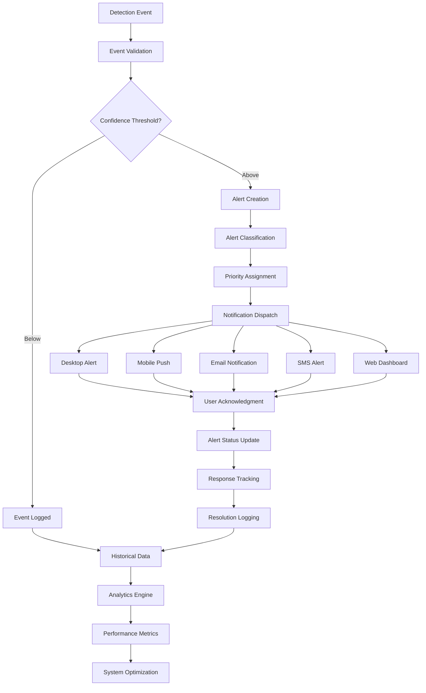
```mermaid
flowchart TD
    A[Detection Event] --> B[Event Validation]
    B --> C{Confidence Threshold?}
    C -->|Below| D[Event Logged]
    C -->|Above| E[Alert Creation]
    
    E --> F[Alert Classification]
    F --> G[Priority Assignment]
    G --> H[Notification Dispatch]
    
    H --> I[Desktop Alert]
    H --> J[Mobile Push]
    H --> K[Email Notification]
    H --> L[SMS Alert]
    H --> M[Web Dashboard]
    
    I --> N[User Acknowledgment]
    J --> N
    K --> N
    L --> N
    M --> N
    
    N --> O[Alert Status Update]
    O --> P[Response Tracking]
    P --> Q[Resolution Logging]
    
    D --> R[Historical Data]
    Q --> R
    
    R --> S[Analytics Engine]
    S --> T[Performance Metrics]
    T --> U[System Optimization]
```

### Alert Escalation Flow

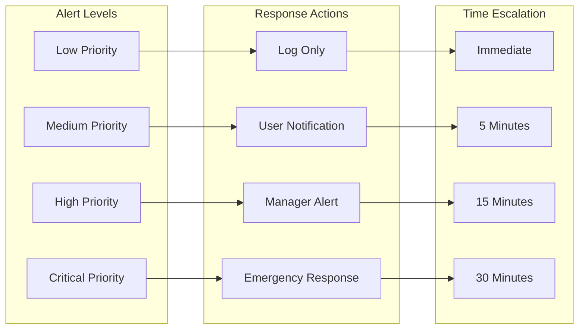
```mermaid
flowchart LR
    subgraph "Alert Levels"
        A[Low Priority]
        B[Medium Priority]
        C[High Priority]
        D[Critical Priority]
    end
    
    subgraph "Response Actions"
        E[Log Only]
        F[User Notification]
        G[Manager Alert]
        H[Emergency Response]
    end
    
    subgraph "Time Escalation"
        I[Immediate]
        J[5 Minutes]
        K[15 Minutes]
        L[30 Minutes]
    end
    
    A --> E
    B --> F
    C --> G
    D --> H
    
    E --> I
    F --> J
    G --> K
    H --> L
```

---

## 🔧 Performance Monitoring

### System Health Monitoring

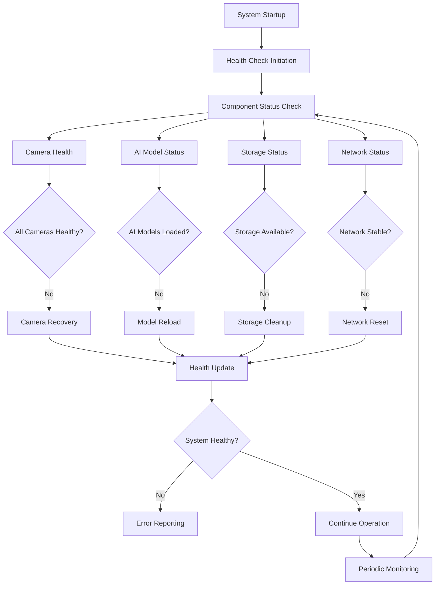
```mermaid
flowchart TD
    A[System Startup] --> B[Health Check Initiation]
    B --> C[Component Status Check]
    
    C --> D[Camera Health]
    C --> E[AI Model Status]
    C --> F[Storage Status]
    C --> G[Network Status]
    
    D --> H{All Cameras Healthy?}
    E --> I{AI Models Loaded?}
    F --> J{Storage Available?}
    G --> K{Network Stable?}
    
    H -->|No| L[Camera Recovery]
    I -->|No| M[Model Reload]
    J -->|No| N[Storage Cleanup]
    K -->|No| O[Network Reset]
    
    L --> P[Health Update]
    M --> P
    N --> P
    O --> P
    
    P --> Q{System Healthy?}
    Q -->|No| R[Error Reporting]
    Q -->|Yes| S[Continue Operation]
    
    S --> T[Periodic Monitoring]
    T --> C
```

### Performance Metrics Collection

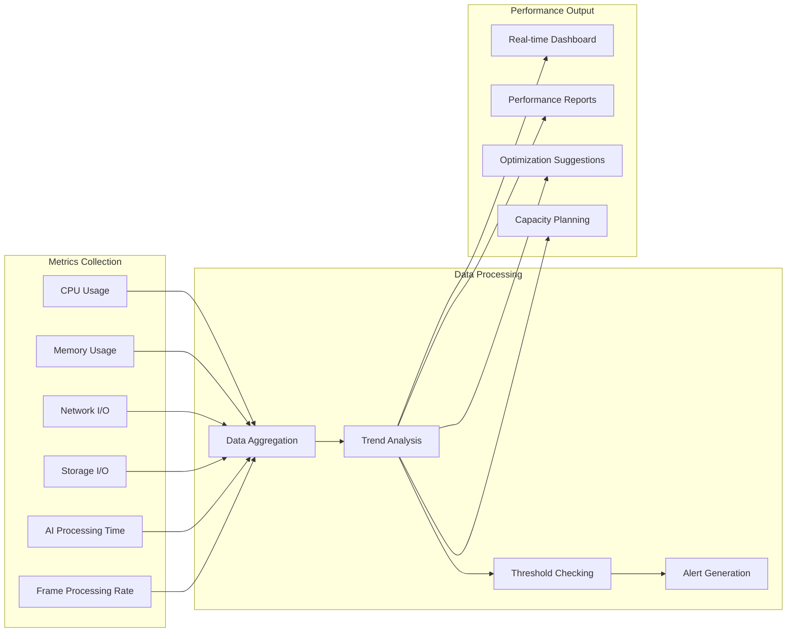
```mermaid
flowchart LR
    subgraph "Metrics Collection"
        A[CPU Usage]
        B[Memory Usage]
        C[Network I/O]
        D[Storage I/O]
        E[AI Processing Time]
        F[Frame Processing Rate]
    end
    
    subgraph "Data Processing"
        G[Data Aggregation]
        H[Trend Analysis]
        I[Threshold Checking]
        J[Alert Generation]
    end
    
    subgraph "Performance Output"
        K[Real-time Dashboard]
        L[Performance Reports]
        M[Optimization Suggestions]
        N[Capacity Planning]
    end
    
    A --> G
    B --> G
    C --> G
    D --> G
    E --> G
    F --> G
    
    G --> H
    H --> I
    I --> J
    
    H --> K
    H --> L
    H --> M
    H --> N
```

---

## 🧪 Testing & Quality Assurance

### Comprehensive Testing Strategy

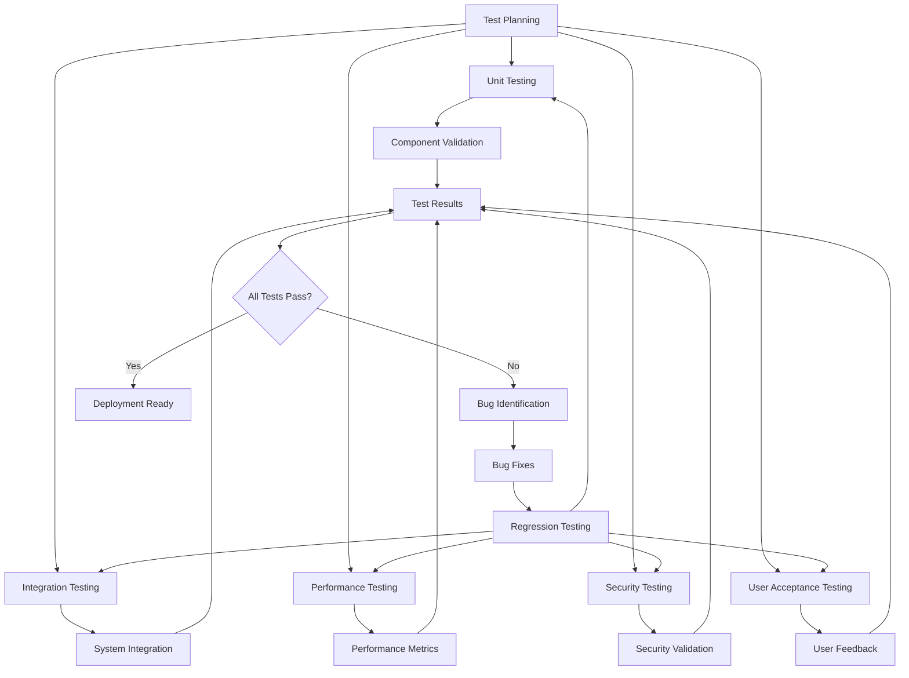
```mermaid
flowchart TD
    A[Test Planning] --> B[Unit Testing]
    A --> C[Integration Testing]
    A --> D[Performance Testing]
    A --> E[Security Testing]
    A --> F[User Acceptance Testing]
    
    B --> G[Component Validation]
    C --> H[System Integration]
    D --> I[Performance Metrics]
    E --> J[Security Validation]
    F --> K[User Feedback]
    
    G --> L[Test Results]
    H --> L
    I --> L
    J --> L
    K --> L
    
    L --> M{All Tests Pass?}
    M -->|No| N[Bug Identification]
    M -->|Yes| O[Deployment Ready]
    
    N --> P[Bug Fixes]
    P --> Q[Regression Testing]
    Q --> B
    Q --> C
    Q --> D
    Q --> E
    Q --> F
```

### Performance Testing Flow

```mermaid
flowchart LR
    subgraph "Test Scenarios"
        A[Single Camera]
        B[Multiple Cameras]
        C[High Load]
        D[Stress Test]
        E[Endurance Test]
    end
    
    subgraph "Performance Metrics"
        F[Frame Rate]
        G[Detection Latency]
        H[Memory Usage]
        I[CPU Usage]
        J[Response Time]
    end
    
    subgraph "Test Execution"
        K[Test Setup]
        L[Data Collection]
        M[Analysis]
        N[Reporting]
    end
    
    A --> K
    B --> K
    C --> K
    D --> K
    E --> K
    
    K --> L
    L --> M
    M --> N
    
    L --> F
    L --> G
    L --> H
    L --> I
    L --> J
```

---

## 📈 Deployment & Scaling

### Production Deployment Flow

```mermaid
flowchart TD
    A[Code Review] --> B[Automated Testing]
    B --> C{Tests Pass?}
    C -->|No| D[Fix Issues]
    C -->|Yes| E[Build Artifacts]
    
    D --> B
    E --> F[Staging Deployment]
    F --> G[Staging Tests]
    
    G --> H{Staging OK?}
    H -->|No| I[Rollback]
    H -->|Yes| J[Production Deployment]
    
    I --> D
    J --> K[Health Checks]
    K --> L{System Healthy?}
    
    L -->|No| M[Rollback]
    L -->|Yes| N[Monitor Performance]
    
    M --> D
    N --> O[Performance Analysis]
    O --> P{Performance OK?}
    
    P -->|No| Q[Optimization]
    P -->|Yes| R[Deployment Complete]
    
    Q --> D
```

### Auto-scaling Architecture

```mermaid
flowchart LR
    subgraph "Monitoring"
        A[Performance Metrics]
        B[Resource Usage]
        C[Load Indicators]
        D[Health Checks]
    end
    
    subgraph "Scaling Logic"
        E[Threshold Analysis]
        F[Scaling Decision]
        G[Resource Allocation]
        H[Load Balancing]
    end
    
    subgraph "Scaling Actions"
        I[Scale Up]
        J[Scale Down]
        K[Load Distribution]
        L[Resource Optimization]
    end
    
    A --> E
    B --> E
    C --> E
    D --> E
    
    E --> F
    F --> G
    G --> H
    
    F --> I
    F --> J
    G --> K
    H --> L
```

---

## 🔮 Future Architecture Evolution

### Microservices Migration

```mermaid
flowchart TD
    A[Monolithic Architecture] --> B[Service Identification]
    B --> C[API Design]
    C --> D[Service Decomposition]
    
    D --> E[Camera Service]
    D --> F[Detection Service]
    D --> G[Alert Service]
    D --> H[User Service]
    D --> I[Storage Service]
    
    E --> J[Service Implementation]
    F --> J
    G --> J
    H --> J
    I --> J
    
    J --> K[Service Testing]
    K --> L[Gradual Migration]
    L --> M[Load Balancing]
    M --> N[Service Mesh]
    
    N --> O[Microservices Architecture]
    O --> P[Auto-scaling]
    P --> Q[Container Orchestration]
```

### Cloud-Native Architecture

```mermaid
flowchart LR
    subgraph "Container Platform"
        A[Docker Containers]
        B[Kubernetes Cluster]
        C[Service Mesh]
        D[Load Balancer]
    end
    
    subgraph "Cloud Services"
        E[Auto-scaling]
        F[Load Balancing]
        G[Monitoring]
        H[Logging]
    end
    
    subgraph "Data Layer"
        I[Distributed Database]
        J[Message Queue]
        K[Cache Layer]
        L[Storage Service]
    end
    
    A --> B
    B --> C
    C --> D
    
    D --> E
    E --> F
    F --> G
    G --> H
    
    B --> I
    B --> J
    B --> K
    B --> L
```

---

**Document Version**: 1.0  
**Last Updated**: December 2024  
**Prepared By**: AI Assistant  
**Project**: FireVision Pro - Technical Diagrams  

---

*This document provides comprehensive technical diagrams and flowcharts that complement the main paper presentation, offering detailed insights into the system architecture, data flows, and technical implementation of the FireVision Pro surveillance system.*
