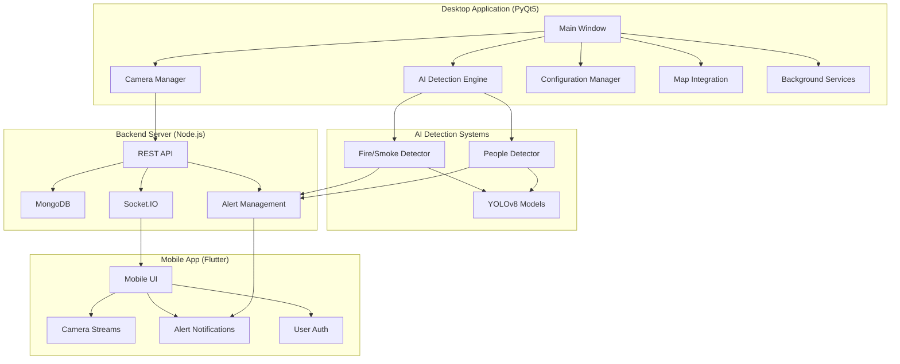
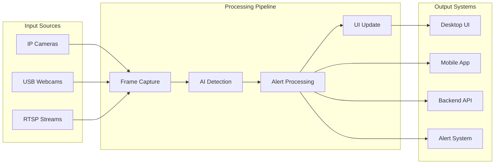
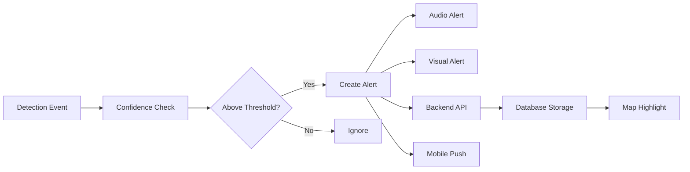

# Fire Vision Pro - Advanced CCTV Surveillance System

[](https://www.python.org/)
[](https://www.riverbankcomputing.com/software/pyqt/)
[](https://github.com/ultralytics/ultralytics)
[](https://nodejs.org/)
[](https://flutter.dev/)
[](LICENSE)
[](BUILD_INSTRUCTIONS.md)

A comprehensive CCTV surveillance system with AI-powered fire/smoke detection, people counting, and real-time monitoring capabilities. Built with Python, PyQt5, YOLOv8, Node.js, and Flutter.

## 🚀 Features

### 🔥 AI-Powered Detection
- **Fire & Smoke Detection**: Real-time YOLOv8-based detection
- **People Counting**: Advanced person detection and counting
- **Confidence Thresholds**: Configurable detection sensitivity
- **Alert System**: Audio/visual notifications with cooldown

### 📹 Camera Management
- **Multi-Source Support**: IP cameras, USB webcams, RTSP streams
- **Real-time Streaming**: Optimized video capture and processing
- **Health Monitoring**: Automatic reconnection and error handling
- **Settings Control**: Resolution, FPS, brightness, contrast
- **Recording Schedules**: Automated recording based on time/motion

### 🗺️ Location Services
- **GPS Integration**: Camera location mapping
- **Interactive Maps**: Folium-based map visualization
- **Fire Alert Mapping**: Real-time location display during alerts
- **Emergency Response**: Location-based alert routing

### 🔐 Security & Authentication
- **Multi-User Support**: Role-based access control
- **Password Security**: SHA-256 encryption
- **Session Management**: Remember login functionality
- **Audit Logging**: Comprehensive operation tracking

### 📱 Cross-Platform Support
- **Desktop Application**: PyQt5-based professional interface
- **Mobile Application**: Flutter-based mobile app
- **Web Dashboard**: Node.js backend with admin interface
- **System Tray**: Background operation capability

## 🏗️ System Architecture



## 🔄 Data Flow



## 🛠️ Installation

### Prerequisites

- **Python 3.8+**
- **Node.js 16+**
- **MongoDB**
- **Flutter SDK** (for mobile app)

### Quick Start

1. **Clone the repository**
```bash
git clone https://github.com/your-username/fire-vision-pro.git
cd fire-vision-pro
```

2. **Install Python dependencies**
```bash
pip install -r requirements.txt
```

3. **Install Voice Commands** (Optional)
```bash
python install_voice_dependencies.py
```

4. **Setup Backend Server**
```bash
cd backend_server
npm install
npm start
```

5. **Run Desktop Application**
```bash
python main.py
```

6. **Test Voice Commands** (Optional)
```bash
python test_voice_commands.py
```

5. **Build Mobile App** (Optional)
```bash
cd app/foc_version1
flutter pub get
flutter build apk
```

## 📁 Project Structure

```
fire-vision-pro/
├── 📄 main.py                      # Main application entry
├── 🔧 enhanced_camera_manager.py   # Camera management system
├── 🔥 fire_smoke_detector.py       # AI fire/smoke detection
├── 👥 people_detector.py           # AI people detection
├── ⚙️ config_manager.py            # Configuration management
├── 🗺️ map_integration.py           # Location services
├── 🖥️ backend_server/              # Node.js backend
│   ├── server.js                   # Main server file
│   ├── package.json                # Node.js dependencies
│   └── admin_dashboard.html        # Web dashboard
├── 📱 app/                         # Flutter mobile app
│   └── foc_version1/
│       ├── lib/                    # Dart source code
│       ├── android/                # Android platform
│       ├── ios/                    # iOS platform
│       └── pubspec.yaml            # Flutter dependencies
├── 📂 config/                      # Configuration files
├── 🎬 recordings/                  # Video recordings
├── 🚨 event_clips/                 # Alert video clips
├── 📋 requirements.txt             # Python dependencies
└── 📖 BUILD_INSTRUCTIONS.md        # Build documentation
```

## ⚙️ Configuration

### Camera Settings
```json
{
  "camera_id": "cam_001",
  "name": "Main Entrance",
  "source": "rtsp://192.168.1.100:554/stream",
  "type": "ip_camera",
  "settings": {
    "resolution": "1920x1080",
    "fps": 30,
    "detection_enabled": true,
    "recording_enabled": true
  }
}
```

### AI Detection Settings
```json
{
  "fire_smoke_detection": {
    "enabled": true,
    "confidence_threshold": 0.5,
    "alert_cooldown": 10
  },
  "people_detection": {
    "enabled": true,
    "confidence_threshold": 0.6
  }
}
```

## 🎤 Voice Commands

FireVision Pro includes a comprehensive voice command system for hands-free operation:

### Quick Voice Commands
- **"Fire Vision show cameras"** - Open camera view
- **"Fire Vision add camera"** - Add new camera
- **"Fire Vision show alerts"** - View alerts
- **"Fire Vision start service"** - Start background service
- **"Fire Vision help"** - Get command list

### Features
- **Wake Word System**: Say "Fire Vision" to activate
- **Natural Language**: Use conversational commands
- **Voice Feedback**: System responds with speech
- **System Tray Control**: Control from system tray
- **Multi-platform**: Works on Windows, Linux, macOS

### Installation
```bash
python install_voice_dependencies.py
```

For detailed voice command documentation, see [VOICE_COMMANDS_README.md](VOICE_COMMANDS_README.md)

## 🚨 Alert System



## 📊 Performance Metrics

| Component | Metric | Target | Current |
|-----------|--------|--------|---------|
| Camera Processing | FPS | 30 | 25-30 |
| AI Detection | Latency | <100ms | 80-120ms |
| Alert Response | Time | <2s | 1.5-2.5s |
| UI Responsiveness | Frame Rate | 60 FPS | 55-60 FPS |

## 🔧 Build & Deployment

### Desktop Application
```bash
# Using PyInstaller
pyinstaller --onefile --windowed --name=FireVisionPro main.py

# Using build script
python build_app.bat
```

### Mobile Application
```bash
cd app/foc_version1
flutter build apk --release
flutter build ios --release
```

## 🧪 Testing

```bash
# Run unit tests
python -m pytest tests/

# Run integration tests
python -m pytest tests/integration/

# Run performance tests
python -m pytest tests/performance/
```

## 📈 Roadmap

- [ ] **Advanced AI Models**: Improved detection accuracy
- [ ] **IoT Integration**: Sensor network support
- [ ] **Cloud-native Architecture**: Kubernetes deployment
- [ ] **Real-time Analytics**: Advanced reporting dashboard
- [ ] **Multi-site Management**: Distributed camera networks
- [ ] **Predictive Maintenance**: AI-powered system health

## 🤝 Contributing

We welcome contributions! Please see our [Contributing Guidelines](CONTRIBUTING.md) for details.

1. Fork the repository
2. Create a feature branch (`git checkout -b feature/amazing-feature`)
3. Commit your changes (`git commit -m 'Add amazing feature'`)
4. Push to the branch (`git push origin feature/amazing-feature`)
5. Open a Pull Request

## 📄 License

This project is licensed under the Private License - see the [LICENSE](LICENSE) file for details.

## 🆘 Support

- **Documentation**: [Wiki](https://github.com/your-username/fire-vision-pro/wiki)
- **Issues**: [GitHub Issues](https://github.com/your-username/fire-vision-pro/issues)
- **Discussions**: [GitHub Discussions](https://github.com/your-username/fire-vision-pro/discussions)
- **Email**: support@firevisionpro.com

## 🙏 Acknowledgments

- [Ultralytics](https://github.com/ultralytics/ultralytics) for YOLOv8
- [OpenCV](https://opencv.org/) for computer vision
- [PyQt5](https://www.riverbankcomputing.com/software/pyqt/) for GUI
- [Flutter](https://flutter.dev/) for mobile development
- [Node.js](https://nodejs.org/) for backend services
- [MongoDB](https://www.mongodb.com/) for database
- [Folium](https://python-visualization.github.io/folium/) for maps

## 📞 Contact

- **Project Link**: [https://github.com/your-username/fire-vision-pro](https://github.com/your-username/fire-vision-pro)
- **Website**: [https://firevisionpro.com](https://firevisionpro.com)
- **Email**: info@firevisionpro.com

---

**Fire Vision Pro** - Advanced CCTV Surveillance with AI Detection 🚨🔥📹
