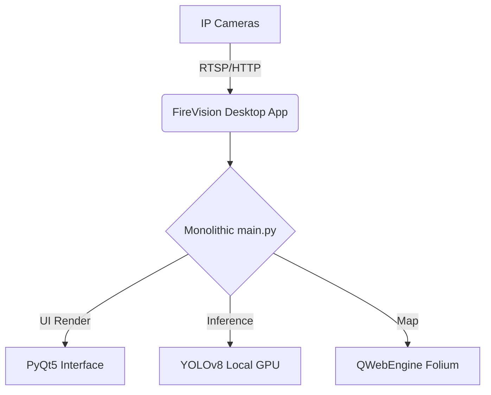
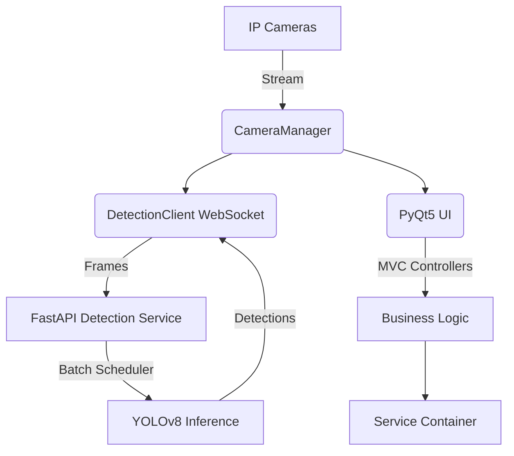
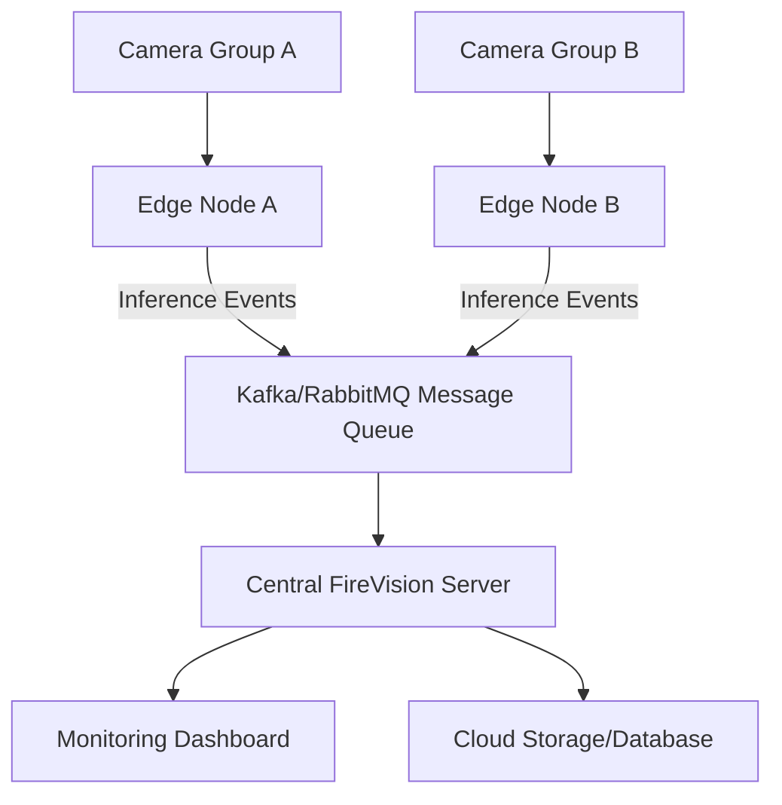

# FireVision System Architecture

## 1. Current Desktop Architecture (Legacy)

```mermaid
graph TD
    A[IP Cameras] -->|RTSP/HTTP| B(FireVision Desktop App)
    B --> C{Monolithic main.py}
    C -->|UI Render| D[PyQt5 Interface]
    C -->|Inference| E[YOLOv8 Local GPU]
    C -->|Map| F[QWebEngine Folium]
```

## 2. Refactored Modular Architecture

```mermaid
graph TD
    A[IP Cameras] -->|Stream| B(CameraManager)
    B --> C(DetectionClient WebSocket)
    B --> D(PyQt5 UI)
    
    C -->|Frames| E[FastAPI Detection Service]
    E -->|Batch Scheduler| F[YOLOv8 Inference]
    F -->|Detections| C
    
    D -->|MVC Controllers| G[Business Logic]
    G --> H[Service Container]
```

## 3. Edge AI Scalable Architecture (Future Ready)

```mermaid
graph TD
    A[Camera Group A] --> B[Edge Node A]
    C[Camera Group B] --> D[Edge Node B]
    
    B -->|Inference Events| E[Kafka/RabbitMQ Message Queue]
    D -->|Inference Events| E
    
    E --> F[Central FireVision Server]
    F --> G[Monitoring Dashboard]
    F --> H[Cloud Storage/Database]
```
